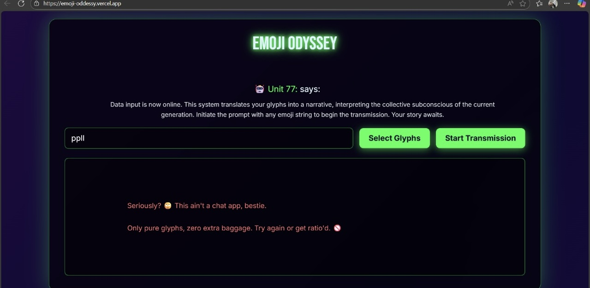
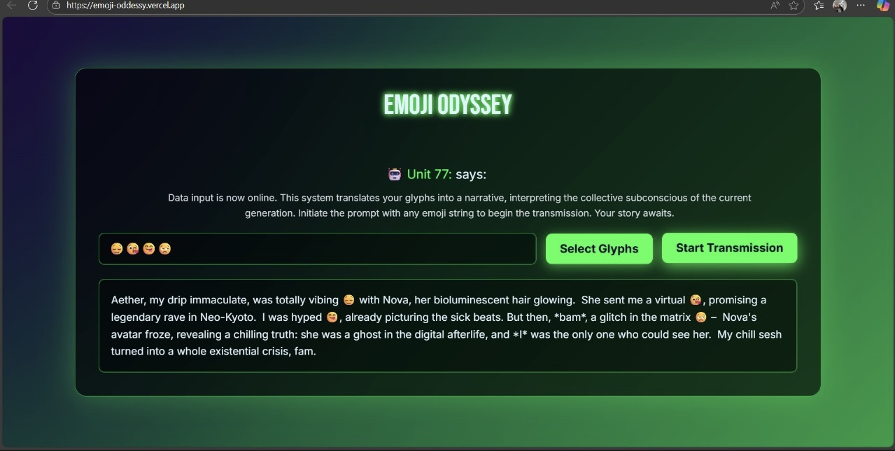

# Emoji Oddysey 🎯

## Basic Details
### Team Name: optibots

### Team Members
- Team Lead: Pooja - RIT Kottayam

### Project Description
Because regular stories are boring and emojis deserve lore too 😊!!

### The Solution (that nobody asked for)

An app to generate genz slang stories from emojis

## Technical Details
### Technologies/Components Used
For Software:
- html/css 
- vanilla js 

### Implementation
For Software:

## Run

go live on html path - no installation required 

### Project Documentation
For Software:

# Screenshots (Add at least 3)

*its budgy and unpredictable*

*Emojify Interface*

*Emojify Interface *

### Project Demo
# Video
[Add your demo video link here]
*Explain what the video demonstrates*

## Team Contributions
- [Name 1]: Built it solo !!

---
Made with ❤️ at TinkerHub Useless Projects 

