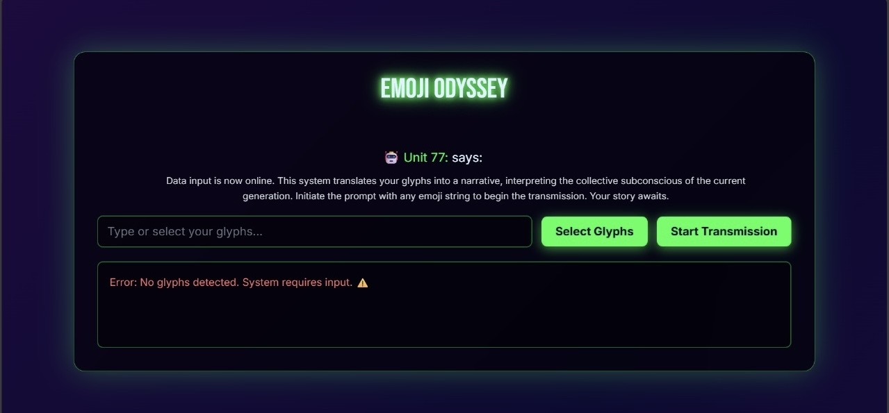

# Emoji Oddysey 🎯

## Basic Details
### Team Name: optibots

### Team Members
- Team Lead: Pooja - RIT Kottayam

### Project Description
Because regular stories are boring and emojis deserve lore too 😊!!

### The Solution (that nobody asked for)

An app to generate genz slang stories from emojis

## Technical Details
### Technologies/Components Used
For Software:
- html/css 
- vanilla js 

### Implementation
For Software:

## Run

go live on html path - no installation required 

### Project Documentation
For Software:

# Screenshots (Add at least 3)

*its budgy and unpredictable*

*Emojify Interface *

### Project Demo
# Video

https://github.com/user-attachments/assets/b5658db9-d5fc-41c0-9d1a-cf4d1babb4ec

*Explain what the video demonstrates*
📽 Demo Video: Emoji Odyssey in Action

This video shows a full walkthrough of the Emoji Odyssey web app:
	•	💻 User selects emojis using the built-in emoji keyboard
	•	⚙ Story gets generated instantly in a Gen Z slang-filled tone
	•	🤖 Animated robot reacts by jumping or cheering when a story appears
	•	🐛 Includes both working combos and buggy emoji inputs to show what happens when generation fails
	•	🎉 Captures the randomness, humor, and chaotic creativity behind every emoji-based story

The video highlights the real-time feel of the Emoji-fy experience, giving a clear look into how emojis become quirky, AI-generated Gen Z stories.
## Team Contributions
- [Name 1]: Built it solo !!

---
Made with ❤️ at TinkerHub Useless Projects 

